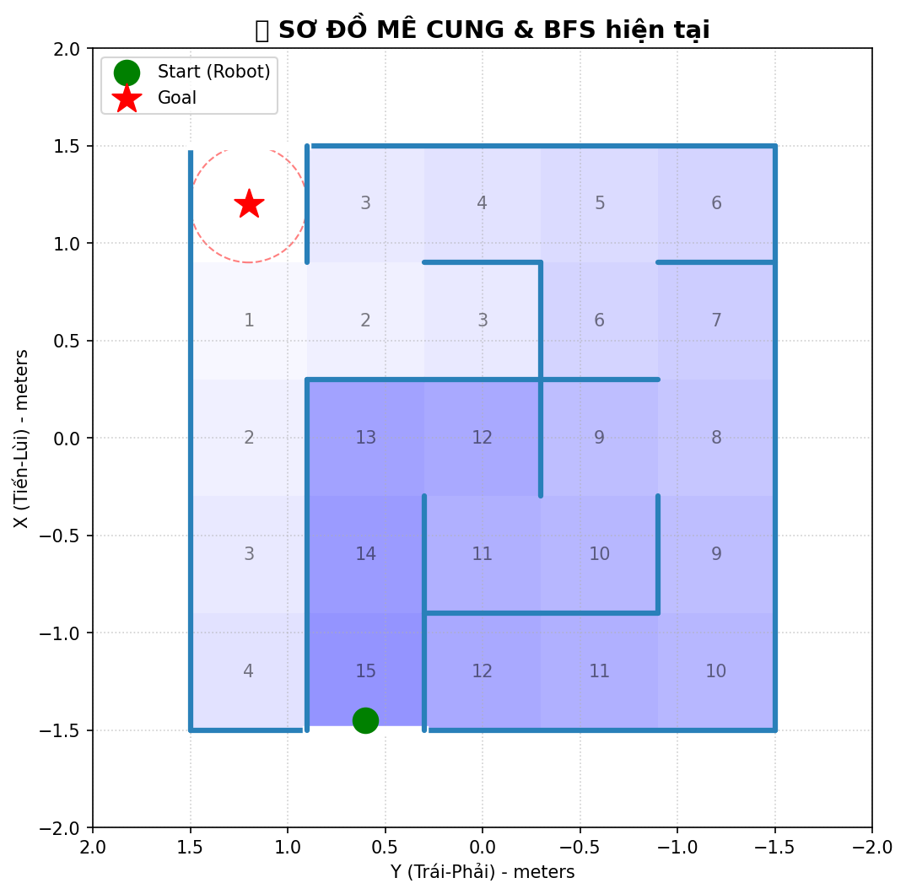
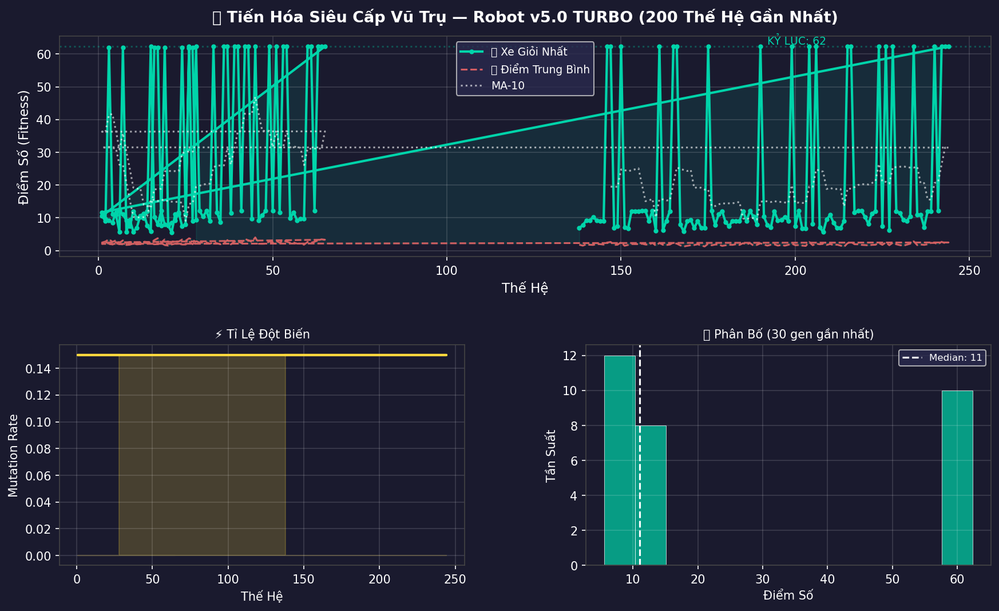

# 🤖 Swarm AI Maze Solver

### Evolutionary Robotics with Genetic Algorithms, RNN & Gazebo Simulation

[](https://www.python.org/)
[](https://docs.ros.org/en/humble/)
[](https://gazebosim.org/)
[](LICENSE)

An autonomous robotics framework that evolves a **swarm of 16 robots** to solve procedurally generated 5×5 mazes using **Neuroevolution (Genetic Algorithm + Recurrent Neural Network)** inside a physics-accurate **Gazebo** simulation, orchestrated through **ROS2**.

---

## 📸 Demo

<p align="center">
  
  &nbsp;&nbsp;&nbsp;&nbsp;
  
</p>
<p align="center">
  <em>Left: Procedurally generated maze with BFS distance heatmap &nbsp;|&nbsp; Right: Evolutionary fitness progress over 200+ generations</em>
</p>

---

## 🧬 How It Works

The project uses a **two-phase Curriculum Learning** pipeline to evolve robot intelligence from scratch — no human-designed rules, no gradient descent, purely survival of the fittest.

### Phase 1 — Specialist Training (`train_ga.py`)
> Train individual "genius" brains, each specialized for **one specific maze**.

- A population of **96 neural networks** competes on a single maze layout.
- Robots that navigate closer to the goal (measured by BFS distance) get higher fitness.
- After **3 consecutive generations** with at least one robot reaching the goal → the best brain **graduates** and is saved as a `champion_*.npy` file.
- The system **auto-generates a new maze** and repeats — producing **70+ champion brains** across 70+ unique mazes.

### Phase 2 — Generalist Evolution (`train_multi_ga.py`)
> Forge a single "universal" brain that can solve **any unseen maze**.

- All 70+ champion brains are used as **seeds** for a population of 30.
- Each brain is tested on **16 different mazes simultaneously** — fitness = average performance across all 16.
- Brains that "memorized" their training maze (overfitting) are naturally eliminated.
- Only brains with **generalized spatial reasoning** survive → producing a universal maze solver.

```
Phase 1: Specialist Factory               Phase 2: Generalist Forge
┌─────────────────────────┐               ┌──────────────────────────┐
│  Map 1 → champion_01    │               │  70+ champions (seeds)   │
│  Map 2 → champion_02    │  ─────────►   │  Test on 16 random mazes │
│  ...                    │               │  Keep generalized logic  │
│  Map 70 → champion_70   │               │  → Universal Brain 🧠    │
└─────────────────────────┘               └──────────────────────────┘
```

---

## 🏗️ System Architecture

```
┌─────────────────────────────────────────────────────────────────┐
│  Layer 4: EVOLUTION ENGINE — train_ga.py / train_multi_ga.py    │
│  Population management, tournament selection, crossover,        │
│  Gaussian mutation, Hall of Fame, auto-curriculum               │
├─────────────────────────────────────────────────────────────────┤
│  Layer 3: NEURAL BRAIN — ga_model.py                            │
│  Custom RNN (1450 params) — 26 inputs → 2 wheel velocities     │
│  + 8-unit recurrent memory (short-term spatial reasoning)       │
├─────────────────────────────────────────────────────────────────┤
│  Layer 2: GAME LOGIC — robot.py / multi_robot.py                │
│  Lidar processing (48→24 rays), BFS waypoint navigation,       │
│  compass heading, collision detection, fitness scoring          │
├─────────────────────────────────────────────────────────────────┤
│  Layer 1: PHYSICS — Gazebo + ROS2 Bridge                        │
│  48-ray GPU Lidar, Mecanum drive, ground-truth odometry,        │
│  parallel teleport reset, physics-accurate simulation           │
└─────────────────────────────────────────────────────────────────┘
```

### Data Flow (per timestep)

```
Gazebo Lidar (48 rays, 360°)
  → ROS2 LaserScan topic
    → Filter NaN → Clip to 1m → Invert → MaxPool 48→24
      → Append compass (distance + angle to next waypoint) = 26 inputs
        → RNN forward pass (26 + 8 memory → 34 → hidden 32 → 10 outputs)
          → Sigmoid → wheel velocities (v_left, v_right)
            → Differential drive → Twist command → Gazebo
              → Robot moves → New Lidar scan → Repeat
```

---

## 🧠 Neural Network Design

| Component | Details |
|:----------|:--------|
| **Architecture** | Single-layer RNN with 8-unit recurrent memory |
| **Input** | 24 Lidar sectors + 2 compass values = **26** |
| **Hidden** | 32 neurons (ReLU activation) |
| **Output** | 2 wheel speeds (Sigmoid) + 8 memory cells (Tanh) |
| **Total Parameters** | **1,450** (pure NumPy — no PyTorch/TensorFlow needed) |
| **Why NumPy?** | GA doesn't use gradients — direct weight mutation is 10-50x faster without autograd overhead |

---

## 🔑 Key Technical Features

| Feature | Description |
|:--------|:------------|
| **Procedural Maze Generation** | DFS-based algorithm generates "perfect" mazes (exactly one solution path, no loops) |
| **BFS Fitness Scoring** | Cheat-proof fitness — rewards only real progress along the solution path |
| **Parallel Swarm Evaluation** | 16 robots run simultaneously in Gazebo, cutting training time by 16× |
| **Hall of Fame + Age Decay** | Top-10 all-time brains preserved; stale entries demoted to prevent false elites |
| **Auto-Curriculum Pipeline** | `auto_curriculum.py` loops: train → graduate → new maze → repeat (24/7 unattended) |
| **Crash Recovery** | Emergency backups + auto-restart ensure training survives simulator failures |
| **Champion Seeding** | Multi-maze training initializes from 70+ specialist champions for faster convergence |

---

## 📂 Project Structure

```
AI/
├── train_ga.py                  # Specialist training (96 pop, 1 maze)
├── train_multi_ga.py            # Generalist training (30 pop, 16 mazes)
├── auto_curriculum.py           # Auto training loop (train → graduate → new maze)
├── auto_multi.py                # Auto recovery for multi-maze training
│
├── src/
│   ├── core/ga_model.py         # RNN neural network (1450 params)
│   ├── agent/robot.py           # Single-maze game logic
│   ├── agent/multi_robot.py     # Multi-maze game logic
│   ├── environment/
│   │   ├── maze_generator.py    # DFS maze + BFS distance map
│   │   └── multi_maze_generator.py  # 16-maze grid generator
│   └── ros_layer/ros_bridge.py  # ROS2 ↔ Gazebo bridge
│
├── start_ai.launch.py           # ROS2 launch (single-maze, 16 robots)
├── start_multi_ai.launch.py     # ROS2 launch (16 mazes, 16 robots)
├── robot_bao_template.sdf       # Robot model (Mecanum drive, 48-ray Lidar)
├── champions/                   # 70+ graduated champion brains (.npy)
│
├── plot_fitness.py              # Fitness visualization
├── plot_current_maze.py         # Maze + BFS heatmap visualization
└── test_best_multi_5_times.py   # Generalist evaluation on unseen mazes
```

---

## 🚀 Getting Started

### Prerequisites

- **OS:** Ubuntu 22.04
- **ROS2:** Humble Hawksbill
- **Simulator:** Gazebo Harmonic (Ignition)
- **Python:** 3.10+ with `numpy`, `matplotlib`

### Quick Start

```bash
# 1. Clone the repository
git clone https://github.com/nguyengiabao100624/AI-Maze-Solver.git
cd AI-Maze-Solver

# 2. Launch specialist training (auto-generates maze + trains AI)
python3 auto_curriculum.py

# 3. After accumulating champions, launch generalist training
python3 auto_multi.py

# 4. Visualize training progress
python3 plot_fitness.py
```

---

## 📊 Results

- **70+ unique mazes** solved during specialist training phase
- **16 simultaneous robots** evaluated per generation in Gazebo
- Best generalist brain solves **12-16 out of 16** unseen mazes
- Fully autonomous 24/7 training pipeline with crash recovery

---

## 📄 License

This project is licensed under the MIT License — see the [LICENSE](LICENSE) file for details.

---

<p align="center">
  <strong>Built by Nguyễn Gia Bảo</strong><br>
  <em>Evolutionary Robotics • Swarm Intelligence • ROS2 & Gazebo</em>
</p>
